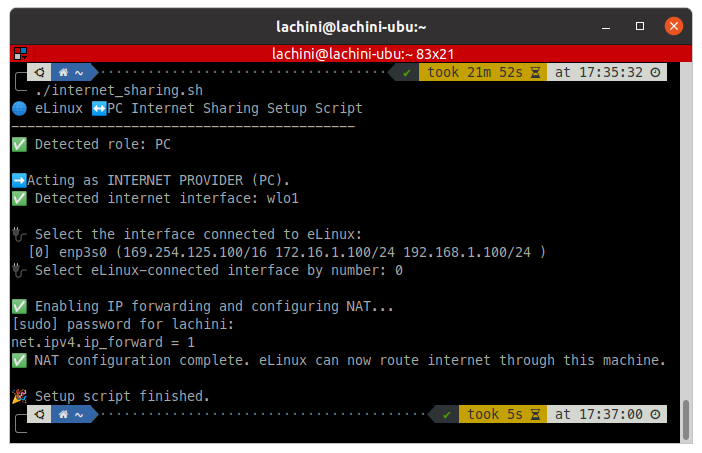
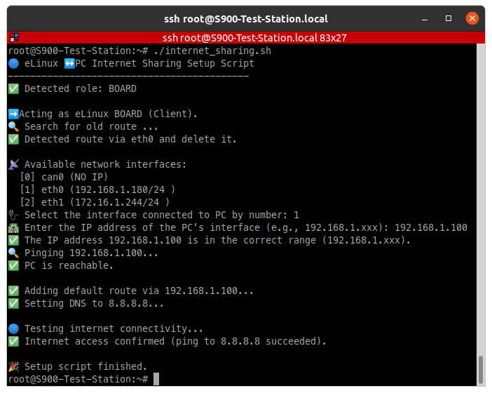

# 🛠️ eLinux ↔️ PC Internet Sharing Script

This Bash script configures IP forwarding from a Linux PC to an eLinux board to provide internet access to the board.

---

## 📦 Features

- Automatic detection of PC vs eLinux board
- Auto or manual selection of interfaces
- NAT configuration using iptables
- DNS and route setup on the board
- Internet connectivity test

---

## 🚀 Usage

1. Download the script:

```bash   
git clone git@github.com:HosseinLachini/Share_Internet.git
cd Share_Internet
```

    
2. Run on the PC:



```bash    
./internet_sharing.sh
```
    
> Will auto-detect internet and ask which interface connects to the board.

3. Run on the eLinux board:


  
```bash    
./internet_sharing.sh
```
    
> Will ask for interface to PC, IP address, and check internet connectivity.

---

## 💡 Requirements

- PC and board both running Linux
- iptables, ip, and ping available
- Script must be run as a user with sudo access

---

## 🔧 Troubleshooting

If internet doesn't work:

- Ensure PC has internet
- Run script on PC *before* running it on the board
- Check USB/Ethernet cable
- Confirm IP and interface are correct
- On PC, verify iptables -t nat -L includes MASQUERADE rule

---

## 📁 Files

- [internet_sharing.sh](internet_sharing.sh) — the main script
- [README.md](README.md) — this manual
